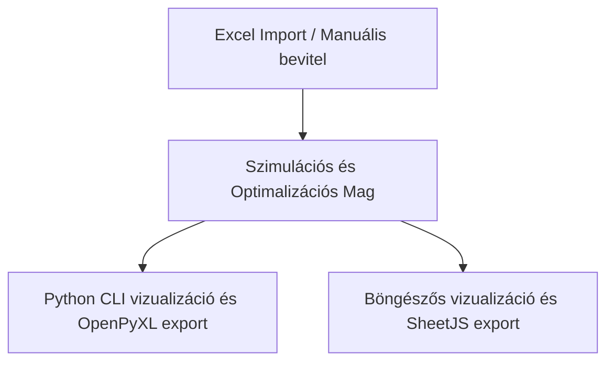

# Szoftverarchitektúra és Algoritmusok / Software Architecture & Algorithms

Ez a dokumentum az érettségi vizsgabeosztó szoftver belső működését, adatmodelljét és optimalizációs algoritmusait mutatja be.

---

## 1. Rendszerarchitektúra / System Architecture Overview

A szoftver két teljesen különálló felületet kínál (Python CLI és böngészős weboldal), amelyek azonban **azonos algoritmikus logikát** valósítanak meg.

- **Python változat ([vizsga_beosztas.py](file:///f:/Antigravity%20projektek/Viszgabeoszt%C3%A1s/vizsga_beosztas.py))**: `dataclass` alapú adatmodellek, `openpyxl` könyvtár az Excel exportáláshoz.
- **Webes változat ([index.html](file:///f:/Antigravity%20projektek/Viszgabeoszt%C3%A1s/index.html))**: ES6 osztályok, reszponzív HTML5/CSS3 UI és `xlsx.full.min.js` (SheetJS) az Excel fájlok beolvasásához és írásához.

---

## 2. Adatmodell / Data Model

Az ütemezés három fő entitáson alapul:
1. **Tárgy (Subject)**:
   - Név és típus (nyelvi vagy nem-nyelvi).
   - Felkészülési idő: nyelvi tárgynál 0 perc, egyébként 20 perc (vagy a megadott érték).
2. **Vizsgázó (Examinee)**:
   - Név, tárgyak listája és hátralévő tárgyak listája (szimuláció közben csökken).
   - Állapota: bent van a teremben (`bent_van`), vizsgázott-e már (`minden_kesz`), belépési és kilépési időpontok.
3. **VizsgaEsemeny (ExamEvent)**:
   - Egy konkrét vizsga leírása: vizsgázó neve, tantárgy, kezdési és befejezési időpont, felkészülés kezdete.

---

## 3. Szimulációs Modell / Simulation Model

Az ütemezés alapja egy eseményvezérelt szimulációs ciklus (`_szimulacio_core`), amely egy előre meghatározott belépési sorrend alapján fut le:

1. **Beléptetés (Admission)**: Amíg a teremben tartózkodók száma kevesebb mint a maximum (5 fő), a beviteli sorrend szerint lépnek be az új diákok.
2. **Felkészülés (Preparation)**: A belépő diák azonnal megkezdi a felkészülést a soron következő tárgyából. A felkészülés végpontja (`felkeszules_vege`) a belépés időpontja + a tantárgy felkészülési ideje.
3. **Vizsga (Examination)**: Ha a bizottság szabad (`ido >= bizottsag_szabad`) és van olyan tanuló a teremben, akinek a felkészülése befejeződött (`felkeszules_vege <= ido`):
   - A program kiválasztja a legmegfelelőbb tanulót (lásd: Választási prioritás).
   - A vizsga lezajlik (15 perc), a bizottság számára bejegyzésre kerül a 2 perc kötelező szünet (`bizottsag_szabad = ido + 15 + 2`).
   - A vizsgázó megkezdi a felkészülést a következő tárgyából (ha van neki).
4. **Kiléptetés (Departure)**: Ha egy vizsgázó az összes tárgyából leérettségizett, és a szimulációs idő eléri az utolsó vizsgájának végét, kikerül a teremből, helyet szabadítva fel.
5. **Időléptetés (Time Progression)**: A szimulációs idő a legközelebbi eseményre ugrik (bizottság felszabadulása, felkészülés vége vagy vizsga befejezése).

### Választási prioritás (Candidate Selection Priority)
Ha a bizottság szabad, a következő vizsgázó kiválasztása az alábbi prioritás szerint történik:
1. **Nem-nyelvi tárgyak elsőbbsége**: Elsőként a nem-nyelvi vizsgára várók közül választunk. Ezen belül az a diák kap elsőbbséget, aki a **legtöbb ideje vár** a felkészülése befejezése óta (ez biztosítja a várakozási idők kiegyenlítését).
2. **Nyelvi tárgyak**: Ha nincs felkészült nem-nyelvi vizsgázó, a nyelvi vizsgára várók közül választ a program az alapján, hogy ki gyűjtötte eddig a legtöbb várakozási időt.

---

## 4. Belépési Idő Optimalizálás / Entry Time Alignment

A szimuláció a diákok beléptetését a terem kapacitása szerint korán kezdi. A felesleges teremben tartózkodás elkerülésére a szimuláció lefutása után egy utólagos korrekciós lépés történik:

$$t_{\text{belépés}} = t_{\text{első vizsga kezdete}} - t_{\text{felkészülési idő}}$$

- **Magyar**: Ez a korrekció nem befolyásolja az ütemezés menetét, de a diákok számára a lehető legkésőbbi belépést határozza meg, így a bent töltött időtartamuk a minimálisra csökken. A konzisztencia érdekében a legelső vizsgaesemény felkészülési kezdete (`felkeszules_kezdet`) is a módosított belépési időhöz igazodik, megszüntetve a fiktív várakozási időket a kijelzésben. Mivel a bent tartózkodási időtartamok ezáltal rövidülnek, a teremkapacitási korlát (max 5 fő) garantáltan nem sérül.
- **English**: This correction does not affect the scheduling order but determines the latest possible entry time for students, minimizing their stay in the room. For consistency, the preparation start time (`felkeszules_kezdet`) of the very first exam event is also aligned with the modified entry time, eliminating any artificial waiting times in the display. Since the room occupancy intervals are shortened, the classroom capacity limit (max 5 students) is guaranteed to hold.

---

## 5. Optimalizációs Stratégiák / Optimization Strategies

A szoftver a bemeneti lista vizsgázóinak belépési sorrendjét (permutációit) optimalizálja. A létszámtól függően két stratégiát alkalmaz:

### A. Teljes Permutációs Keresés (Full Brute-Force) — $N \le 10$
Kis létszám esetén a program kiszámolja az összes lehetséges permutációt ($N!$), lefuttatja mindegyikre a szimulációt, és kiválasztja a legjobbat.
- $N = 7$ esetén ez $5040$ szimuláció (pár milliszekundum).
- $N = 10$ esetén ez $3\ 628\ 800$ szimuláció.

### B. Gördülő Permutációs Keresés (Rolling Brute-Force & Greedy) — $N > 10$
Nagyobb csoportoknál a permutációk száma miatt a teljes keresés nem kivitelezhető. Ekkor a következő hibrid heurisztikus algoritmus fut le:
1. **Jelölt szűrés**: A diákokat előrendezzük (nyelvi tárgyak előre, tárgyak száma szerint csökkenőleg).
2. **Első körös brute-force**: Az első 8 jelöltből kiválasztjuk a teremkapacitásnak megfelelő első 5 diákot az összes lehetséges variációt ($P(8,5) = 6720$) kipróbálva.
3. **Mohó finomítás (Greedy refinement)**: A megmaradt pozíciókra (6. helytől) egyesével próbáljuk beilleszteni a még be nem osztott diákokat, és mindig azt választjuk ki az adott helyre, amelyik a legjobb részeredményt adja a teljes szimulációra nézve.

### Értékelési Metrika (Fitness Function)
A permutációk értékelése lexikografikusan történik az alábbi három szempont szerint (kisebb érték a jobb):

$$\text{Metrika} = (\text{összes\_idő}, \text{max\_várakozás}, \text{üresjárat})$$

1. **Összes idő (Total duration)**: A legelső vizsga kezdetétől az utolsó vizsga végéig eltelt idő percekben.
2. **Maximális várakozás (Max wait time)**: A leghosszabb időtartam, amit egy vizsgázó a felkészülése befejezése és a vizsgája kezdete között várni kényszerült.
3. **Üresjárat (Idle time)**: A vizsgabizottság felesleges várakozási ideje (a kötelező 2 perces szüneteken felül).

---

## 6. Nap-felosztási Logika / Day Splitting Logic

Túl sok vizsgázó esetén az ütemező többnapos beosztást készít:
1. Kiszámolja a napi időkeretbe maximálisan beleférő vizsgák számát:
   
   $$\text{max\_vizsga\_per\_nap} = \lfloor \frac{\text{napi\_időtartam} + 2}{15 + 2} \rfloor$$

2. A vizsgázókat a tárgyaik száma szerint csökkenő sorrendbe rendezi.
3. Egyenletes elosztást (Round-Robin terheléselosztás) alkalmazva napokhoz rendeli a diákokat úgy, hogy a napi vizsgák összege a lehető legközelebb legyen egymáshoz.
4. Ha a szigorú korlát miatt nem férnének be a diákok a minimális napok alá, de új nap nyitása pazarló lenne, a rendszer engedélyez egy minimális túlcsordulást a legkevésbé terhelt napokon.
5. A webes változat ezen felül megpróbálja a beosztást $D-1$ nappal is lefuttatni; ha az így kapott szimuláció teljes vizsgaideje belefér a napi időkorlátba, a rövidebb (kevesebb napos) ütemezést választja.
